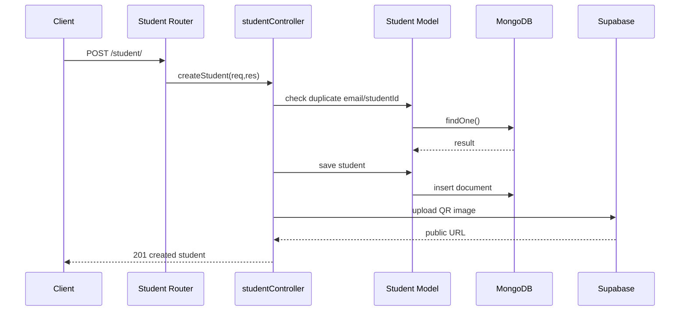
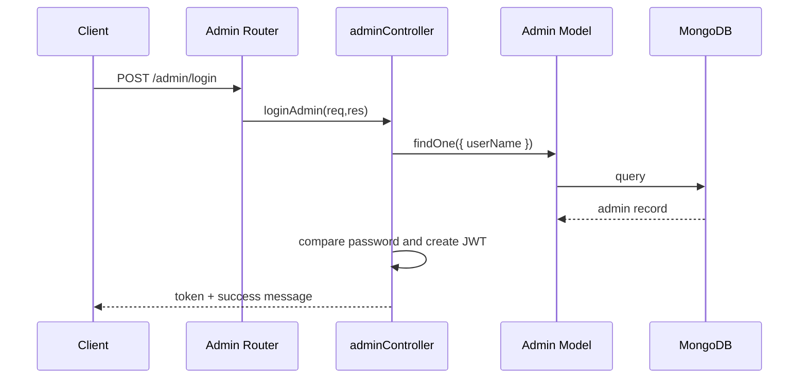
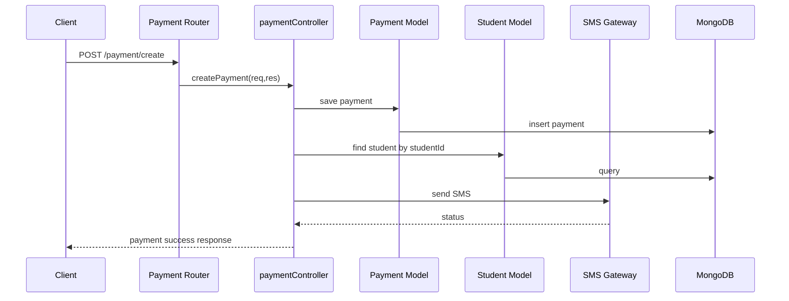
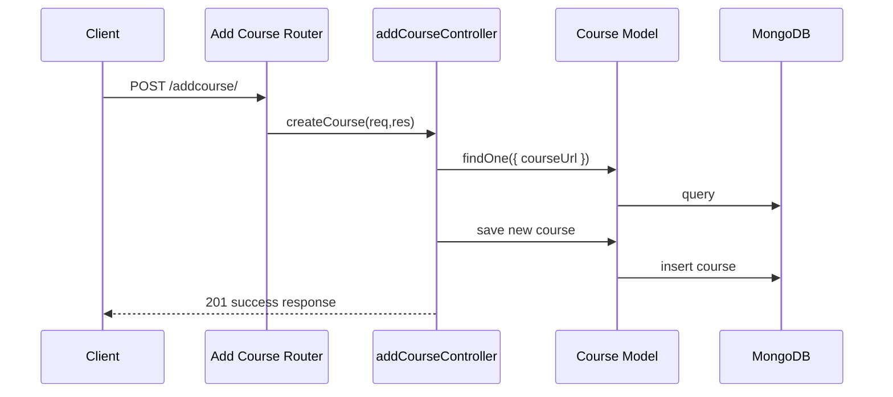

# Combined Mathematics Backend Technical Report

Generated: 2026-07-19

## 1. Project Overview

### Purpose of the Application
This backend powers a student-management and payment-processing system for a Combined Mathematics coaching service. It supports:

- Student registration and lookup
- Admin authentication and administration
- Course catalog management
- Pricing management by institute and batch
- Payment recording and SMS notifications
- Dashboard statistics for administrative reporting
- QR code generation for student identification

The project appears to be a lightweight internal/admin-facing API rather than a public-facing consumer application.

### Architecture Used
The backend follows a modular Node.js + Express architecture with MongoDB as the persistence layer and Mongoose as the ODM.

Core architectural characteristics:

- Express for routing and middleware
- Mongoose schemas/models for document storage
- Controller-based logic separation
- Router-level endpoint grouping
- Environment-based configuration
- Structured logging with Pino
- External integrations for Supabase storage and SMS gateway

This is essentially a layered MVC-style structure, though it is not fully formalized into separate services and utilities beyond controllers, routes, models, and helpers.

### How the Backend Is Organized
The application is split into the following responsibilities:

- Routes define access points for each domain
- Controllers contain business logic, validation, and response handling
- Models define MongoDB document shapes and constraints
- Config houses external service integration setup
- Utils contains reusable helper logic such as logging and SMS sending
- Validators contains schema definitions (currently only for student validation)

### Folder Structure and Responsibilities

```text
config/           -> external integrations such as Supabase client setup
controller/       -> request handlers and business logic
model/            -> Mongoose schemas and models
router/           -> Express route definitions
utils/            -> reusable helpers like logging and SMS
validators/       -> input-validation schemas
index.js          -> application entry point and middleware setup
package.json      -> dependencies, scripts, and metadata
```

---

## 2. Folder & File Analysis

### Root Files

#### index.js
Purpose:
- Application bootstrap file
- Creates the Express app
- Registers middleware
- Mounts route modules
- Connects to MongoDB
- Starts the web server

Key responsibilities:
- Adds request logging middleware with Pino HTTP
- Enables CORS-like headers manually
- Parses JSON bodies
- Reads JWT from the Authorization header and attaches it to req.user
- Exposes health endpoints
- Mounts domain routers under /student, /addcourse, /admin, /payment, /pricing, and /dashboard

Important functions and behavior:
- Uses `pinoHttp()` to generate request logs
- Uses `jwt.verify()` against `process.env.JWT_SECRET`
- Returns 401 for invalid/expired tokens
- Handles global error middleware
- Connects to MongoDB via `mongoose.connect()`

Interactions:
- Imports controllers and routers from controller/ and router/
- Depends on `utils/logger.js` for logging
- Depends on environment variables for DB and JWT configuration

#### package.json
Purpose:
- Declares project metadata and runtime dependencies
- Defines scripts for starting the server (`npm start`) and development (`npm run dev`)

Important dependencies:
- express: web server framework
- mongoose: MongoDB ODM
- jsonwebtoken: JWT implementation
- bcrypt: password hashing
- zod: schema validation
- qrcode: QR code generation
- @supabase/supabase-js: storage integration
- axios: SMS gateway requests
- pino and pino-http: structured logging

#### data.js
Purpose:
- Contains sample payloads and comments for testing admin/student requests
- Not an active part of runtime behavior

#### test.js
Purpose:
- Simple smoke test for a Supabase endpoint
- Used as a connectivity check rather than application testing

#### test-supabase.js
Purpose:
- Verifies Supabase client initialization and bucket listing
- Useful for environment and service validation

---

### config/

#### config/supabase.js
Purpose:
- Initializes the Supabase client if environment values are present
- Exposes the client as a default export

Behavior:
- Reads `SUPABASE_URL` and `SUPABASE_SERVICE_ROLE_KEY`
- Creates a Supabase client with session persistence disabled
- Falls back to a warning if the environment is incomplete

Interactions:
- Used by the student controller to upload QR code images to Supabase storage

---

### controller/

#### controller/addCourseController.js
Purpose:
- Handles course creation and course listing

Functions:
- `createCourse(req, res)`: validates input, checks for duplicate course URL, creates a new course, saves it, and returns 201 on success
- `getCourse(req, res)`: returns all courses from MongoDB

Important behavior:
- Uses `crypto.randomUUID()` to generate a unique `courseId`
- Uses `Course.findOne({ courseUrl })` to prevent duplicates
- Logs with `req.log.debug()`, `req.log.warn()`, `req.log.info()`, and `req.log.error()`

Interactions:
- Uses the `Course` model from model/coursesModel.js
- Routed by router/addCourse.js

#### controller/adminController.js
Purpose:
- Handles admin account creation, admin login, and admin listing

Functions:
- `createAdmin(req, res)`: validates inputs, checks for duplicate username, hashes password with bcrypt, saves the admin, returns 201
- `isAdmin(req, res)`: checks whether the current token belongs to an admin role
- `loginAdmin(req, res)`: validates credentials, compares the submitted password to the stored bcrypt hash, generates a JWT, and returns it to the client
- `getAllAdmins(req, res)`: returns all admin documents

Important behavior:
- Uses `bcrypt.hashSync()` and `bcrypt.compareSync()`
- Issues a JWT with payload `{ id, role: 'admin' }`
- Expires in 1 day
- Returns a 403 when a non-admin attempts to access admin-only functions

Interactions:
- Uses the `AdminModel`
- Is imported by `studentController.js`, `paymentController.js`, `pricingController.js`, and `dashboardController.js` for authorization checks

#### controller/dashboardController.js
Purpose:
- Produces administrative dashboard statistics

Functions:
- `getDashboardStats(req, res)`: computes aggregate metrics for students, payments, income, and institute/batch breakdowns

Important behavior:
- Uses `Student.countDocuments()`
- Uses `Payment.countDocuments({ amount: "3800" })`
- Uses MongoDB aggregation pipelines to compute:
  - monthly income
  - active student counts by batch/institute
  - income breakdown by institute and month

Interactions:
- Uses `Payment` and `Student` models
- Routed by router/dashboardRoute.js

#### controller/paymentController.js
Purpose:
- Handles payment creation and payment history lookup

Functions:
- `createPayment(req, res)`: validates inputs, creates a payment document, finds the student, composes a message, and sends an SMS
- `getPayment(req, res)`: returns payment history for a specific student

Important behavior:
- Enforces admin-only access by calling `isAdmin()`
- Stores payment records with `status: "PAID"`
- Sends SMS to the student phone number
- Uses a composite unique index in the database to prevent duplicate records for the same student/batch/month

Interactions:
- Uses `Payment`, `Student`, `sendSMS`, and `isAdmin`
- Routed by router/paymentRouter.js

#### controller/pricingController.js
Purpose:
- Manages pricing records by institute and batch

Functions:
- `createPricing(req, res)`: validates pricing input and saves a pricing document
- `getPricing(req, res)`: returns a pricing document based on institute and batch query parameters

Important behavior:
- Uses admin-only access checks
- Uses `Pricing.findOne({ institute, batch })`

Interactions:
- Uses `Pricing` and `isAdmin`
- Routed by router/pricingRouter.js

#### controller/studentController.js
Purpose:
- Core student-management controller

Functions:
- `createStudent(req, res)`: validates required fields, checks duplicate email and student ID, creates a student, generates a QR code, uploads it to Supabase, and saves the public URL
- `loginStudent(req, res)`: performs a simple login check using plain equality instead of hashing and does not issue a JWT
- `getStudent(req, res)`: paginated listing of students
- `getOneStudent(req, res)`: fetches a single student by ID
- `deleteStudent(req, res)`: deletes a student by ID
- `scanQr(req, res)`: receives a student ID from a QR-based scan flow and returns it
- `editStudent(req, res)`: updates a student by ID
- `getStudentById(req, res)`: fetches a single student by ID with the route parameter

Important behavior:
- Uses `QRCode.toBuffer()` to create a QR image
- Uploads the QR image to Supabase storage using `supabase.storage.from("qr-codes")...upload()`
- Uses `isAdmin()` for access control but with a flawed usage pattern in several places
- Has a plain-text password comparison in `loginStudent`

Interactions:
- Uses `Student`, `QRCode`, `supabase`, and `isAdmin`
- Routed by router/studentRouter.js

---

### model/

#### model/adminModel.js
Purpose:
- Defines the Mongoose schema for administrators

Fields:
- `name` (String, required)
- `userName` (String, required, unique)
- `password` (String, required)
- `role` (String, default: "admin")

Behavior:
- Stores admin credentials and role
- Passwords are expected to be hashed before being saved

#### model/coursesModel.js
Purpose:
- Defines the Mongoose schema for course records

Fields:
- `courseId` (String, required, unique)
- `courseName` (String, required, unique)
- `courseCategory` (String, required)
- `courseDescription` (String, required)
- `coursePrice` (String, required)
- `courseUrl` (String, required, unique)

Behavior:
- Stores educational course metadata
- `courseUrl` is used as a uniqueness check in the controller

#### model/paymentModel.js
Purpose:
- Defines the Mongoose schema for payment transactions

Fields:
- `studentId` (String, required)
- `batch` (String, required)
- `month` (String, required)
- `amount` (String, required, default: "3800")
- `status` (String, enum: ["PAID", "PENDING", "Failed"], default: "PAID")
- `cardType` (String, default: "Full Payment")
- `paidDate` (Date)

Behavior:
- Uses `{ timestamps: true }`
- Defines a composite unique index on `(studentId, batch, month)`

#### model/pricingModel.js
Purpose:
- Defines pricing data for institutes and batches

Fields:
- `institute` (String, required)
- `batch` (String, required)
- `fullPayment` (Number, required)
- `halfPayment` (Number, required)
- `freePayment` (Number, required)

Behavior:
- Used to return pricing data based on institute/batch query values

#### model/studentModel.js
Purpose:
- Defines the Mongoose schema for student records

Fields:
- `studentId` (String, required, unique)
- `firstName` (String, required)
- `lastName` (String, required)
- `email` (String, required, unique)
- `phone` (String, required)
- `password` (String)
- `institute` (Array of Strings, required)
- `batch` (String, required)
- `qrCode` (String)
- `isActive` (Boolean, required, default: true)
- `dateOfBirth` (Date, required)
- `role` (String, default: "student")
- `paymentType` (String, default: "Full Payment")

Behavior:
- Stores student profile and enrollment data
- Intended to be linked to payments by `studentId`

---

### router/

#### router/adminRouter.js
Purpose:
- Routes admin endpoints

Routes:
- `POST /` → `createAdmin`
- `POST /login` → `loginAdmin`
- `GET /all` → `getAllAdmins`

#### router/studentRouter.js
Purpose:
- Routes student endpoints

Routes:
- `POST /` → `createStudent`
- `POST /login` → `loginStudent`
- `GET /` → `getStudent`
- `GET /scan` → `scanQr`
- `DELETE /:id` → `deleteStudent`
- `GET /getOne/:id` → `getOneStudent`
- `GET /:id` → `getStudentById`
- `PUT /:id` → `editStudent`

#### router/paymentRouter.js
Purpose:
- Routes payment endpoints

Routes:
- `POST /create` → `createPayment`
- `GET /` → `getPayment`

#### router/pricingRouter.js
Purpose:
- Routes pricing endpoints

Routes:
- `POST /create` → `createPricing`
- `GET /` → `getPricing`

#### router/addCourse.js
Purpose:
- Routes course endpoints

Routes:
- `POST /` → `createCourse`
- `GET /` → `getCourse`

#### router/dashboardRoute.js
Purpose:
- Routes dashboard endpoints

Routes:
- `GET /` → `getDashboardStats`

---

### utils/

#### utils/logger.js
Purpose:
- Configures a structured logger using Pino
- Sends logs to terminal in development and to Logtail in production

Behavior:
- Uses `pino.transport()` in non-production mode for pretty output
- Uses `@logtail/pino` in production mode
- Redacts sensitive fields such as authorization headers, passwords, credit cards, and CVVs

#### utils/sendSMS.js
Purpose:
- Sends an SMS using the Quicksend API via Axios

Behavior:
- Normalizes Sri Lankan phone numbers from +94/94 format to 0 format
- Sends a POST request to the external gateway
- Returns a success or failure object

Interactions:
- Called by `paymentController.js` after creating a payment

---

### validators/

#### validators/user.validators.js
Purpose:
- Defines a Zod schema for student validation

Behavior:
- Validates required fields such as student ID, names, email, phone, password, institute, batch, and date of birth
- The schema is defined but not used in the controller layer at the moment

---

## 3. API Architecture

### Route Inventory

| Method | Path | Controller | Request Body / Query | Expected Response | Error Handling |
|---|---|---|---|---|---|
| GET | / | N/A | None | Plain text: server running message | None |
| GET | /health | N/A | None | JSON `{ status: "ok" }` | None |
| POST | /admin/ | `createAdmin` | `{ name, userName, password, role }` | `201` with success message | `400` for missing fields, `409` for duplicate username, `500` for server error |
| POST | /admin/login | `loginAdmin` | `{ userName, password, role }` | `200` with `{ success, message, token }` | `400` for missing fields, `404` for unknown user, `500` for server error |
| GET | /admin/all | `getAllAdmins` | None | Array of admin users | `500` for fetch failure |
| POST | /student/ | `createStudent` | `{ studentId, firstName, lastName, email, phone, password, institute, batch, dateOfBirth, paymentType, isActive }` | `201` with created student and QR info | `403` for unauthorized, `400` for missing/duplicate data, `500` for server error |
| POST | /student/login | `loginStudent` | `{ email, password }` | `200` with login success message | Minimal handling; no robust validation |
| GET | /student/ | `getStudent` | Query: `page`, `limit` | Paginated response with students and totals | `403` for unauthorized, `500` for failure |
| GET | /student/scan | `scanQr` | JSON body `{ studentId }` | JSON with success message and studentId | `403` for unauthorized |
| DELETE | /student/:id | `deleteStudent` | URL param `id` | Deleted student response | `403`, `404`, `500` |
| GET | /student/getOne/:id | `getOneStudent` | URL param `id` | Single student object | `403`, `500` |
| GET | /student/:id | `getStudentById` | URL param `id` | Single student object | `403`, `404`, `500` |
| PUT | /student/:id | `editStudent` | URL param `id` + update body | Updated student object | `403`, `404`, `500` |
| POST | /addcourse/ | `createCourse` | `{ courseName, courseCategory, coursePrice, courseUrl, courseDescription }` | `201` with created course | `400` for missing fields, `409` for duplicate URL, `500` for failure |
| GET | /addcourse/ | `getCourse` | None | Array of courses | `500` for failure |
| POST | /payment/create | `createPayment` | `{ studentId, batch, month, amount, cardType }` | `201` with payment record and SMS status | `400` for missing fields, `409` for duplicate payment, `500` for failure |
| GET | /payment/ | `getPayment` | Query: `studentId` | Payment history list | `403`, `404`, `500` |
| POST | /pricing/create | `createPricing` | `{ institute, batch, fullPayment, halfPayment, freePayment }` | `201` with saved pricing | `400`, `401`, `500` |
| GET | /pricing/ | `getPricing` | Query: `institute`, `batch` | Pricing object | `400`, `404`, `500` |
| GET | /dashboard/ | `getDashboardStats` | None | Dashboard metrics | `403`, `500` |

### Request Flow Notes

- The API is primarily JSON-based.
- Most routes are mounted directly without versioning.
- Admin-protected routes depend on a token being attached to the `Authorization` header.
- There is no central route-level auth middleware; protection is implemented inside controllers via calls to `isAdmin()`.

---

## 4. Database Analysis

### Overall Database Strategy
The project uses MongoDB with Mongoose. Data is stored as documents in separate collections:

- `admins`
- `courses`
- `payments`
- `pricings`
- `students`

### Relationship Model
The schemas are mostly independent. There is no formal Mongoose `ref` relationship between `Student` and `Payment`.

Instead, the relationship is implemented conceptually as:

- A student has a `studentId`
- A payment references that student through `payment.studentId`
- Controllers resolve the student via `Student.findOne({ studentId })`

This is a loosely coupled, string-based relationship rather than a normalized relational join.

### Model-by-Model Analysis

#### Admin Model
Fields:
- `name`
- `userName`
- `password`
- `role`

Validation:
- Required fields on `name`, `userName`, `password`
- `userName` is unique

Usage:
- Used by admin login and admin creation controllers
- Passwords are expected to be bcrypt-hashed before save

#### Student Model
Fields:
- `studentId`
- `firstName`
- `lastName`
- `email`
- `phone`
- `password`
- `institute`
- `batch`
- `qrCode`
- `isActive`
- `dateOfBirth`
- `role`
- `paymentType`

Validation:
- Required fields are defined in the schema for some fields
- `studentId` and `email` are unique

Usage:
- Used heavily in student registration, lookup, update, deletion, and dashboard/payment processing

#### Payment Model
Fields:
- `studentId`
- `batch`
- `month`
- `amount`
- `status`
- `cardType`
- `paidDate`

Validation:
- Required fields are defined for `studentId`, `batch`, `month`, and `amount`
- `status` uses an enum

Indexes:
- Composite unique index on `(studentId, batch, month)`

Usage:
- Used by the payment controller and dashboard aggregation

#### Course Model
Fields:
- `courseId`
- `courseName`
- `courseCategory`
- `courseDescription`
- `coursePrice`
- `courseUrl`

Validation:
- Some fields are marked as required, but the schema uses `require` instead of `required`, which is a potential bug

Usage:
- Used for course catalog CRUD-style listing and creation

#### Pricing Model
Fields:
- `institute`
- `batch`
- `fullPayment`
- `halfPayment`
- `freePayment`

Validation:
- Required fields are enforced in schema

Usage:
- Used to serve pricing by institute and batch

### ER-Style Relationship Summary

```text
Admin      -> no relationships
Student    -> has many Payments (conceptual, via studentId)
Payment    -> belongs to one Student (conceptual, via studentId)
Course     -> independent catalog entity
Pricing    -> independent pricing entity
```

### Observations
- There are no explicit joins or populated references.
- Relationships are implemented manually by matching string IDs rather than Mongoose references.
- The data model is simple and suitable for a small-scale coaching management system.

---

## 5. Authentication & Authorization Analysis

### Is Authentication Implemented?
Yes, but only partially.

### JWT Usage
JWT is used in the admin login flow:

- `loginAdmin()` creates a token with `jwt.sign(...)`
- The token payload contains `id` and `role: 'admin'`
- Middleware in `index.js` reads `Authorization: Bearer <token>` and decodes it with `jwt.verify()`
- The decoded user is attached to `req.user`

### Sessions Usage
No session-based authentication is implemented.

### Cookies Usage
No cookies are used for authentication.

### bcrypt Usage
bcrypt is used for admin password hashing and comparison.

### Role-Based Access Control (RBAC)
RBAC is only partially implemented.

- `AdminModel` has a `role` field with a default of `admin`
- `StudentModel` also has a `role` field with a default of `student`
- `isAdmin()` checks `req.user.role === "admin"`
- Controllers use this helper to guard admin actions

### Admin vs Student Permissions
The code distinguishes admins and students conceptually, but the enforcement is weak:

- Admin routes are mostly protected by controller-side checks
- Student routes do not receive a proper JWT-based authenticated session
- Student login is not secure and does not issue a JWT
- The system is not set up to support fine-grained permissions beyond “admin vs student”

### Protected Routes
The project has the following intended protected areas:

- Admin creation and admin listing
- Student creation, update, delete, and listing
- Payment creation and retrieval
- Pricing creation
- Dashboard statistics

However, route protection is not robust because it relies on manual controller checks rather than a dedicated auth middleware chain.

### Security Strengths
- Password hashing is used for admins
- JWT is used for admin token issuance
- Sensitive fields are redacted in logs
- Authorization header parsing is centralized in index.js

### Security Weaknesses
- Student passwords are stored and compared as plain values
- Student login does not issue a JWT
- No HttpOnly cookie-based auth
- No refresh tokens
- No password reset flow
- No account lockout or brute-force protection
- No route-level middleware for reusable authorization enforcement
- The `isAdmin` helper is sometimes invoked incorrectly, making the checks ineffective in practice

### Missing Security Features
- JWT refresh strategy
- Password hashing for students
- Proper role-permission middleware
- Rate limiting
- CSRF protection
- Input sanitization beyond basic validation
- Audit logging for sensitive admin operations

### Recommendation if Authentication Is Not Fully Implemented
Authentication is only partially implemented. The correct next step is to add a proper JWT + HttpOnly cookie authentication flow for both admins and students.

Recommended approach:

1. Hash student passwords using bcrypt
2. Issue JWT access tokens on login
3. Store tokens in HttpOnly cookies
4. Add middleware to verify authentication for protected routes
5. Add role-based authorization middleware such as `requireAdmin` and `requireStudent`
6. Support refresh tokens for long-lived sessions

---

## 6. Role-Based Access Control (RBAC)

### Existing Roles
The codebase currently implies two roles:

- `admin`
- `student`

### Admin Capabilities
Admins can:
- Create admin accounts
- List admins
- Create students
- View and manage students
- Create payments
- View payment history
- Create pricing
- View dashboard stats

### Student Capabilities
Students can:
- Log in
- Possibly access student-specific data
- Use QR-based scanning workflow in principle

### Current Route Protection Strategy
Route protection is currently handled in each controller via `isAdmin()` checks rather than through a centralized middleware stack.

### Role-Permission Matrix

| Role | Login | Create Student | View Students | Edit/Delete Student | Create Payment | View Dashboard | Create Pricing | Create Course |
|---|---|---|---|---|---|---|---|---|
| Admin | Yes | Yes | Yes | Yes | Yes | Yes | Yes | Yes |
| Student | Yes | No | No | No | No | No | No | No |

### Assessment
The current model is too simple for enterprise-grade RBAC. It would be better to move to a policy-based model with permissions such as:

- `students:create`
- `students:read`
- `students:update`
- `students:delete`
- `payments:create`
- `payments:read`
- `dashboard:read`

---

## 7. Logger System Analysis

### How Logging Works
The backend uses Pino for structured logging and Pino HTTP middleware for request-level logs.

The logging pipeline is defined in:

- `utils/logger.js`
- `index.js` middleware setup

### Where Logs Are Used
The controllers call `req.log` extensively:

- `req.log.debug()` for low-level flow tracing
- `req.log.warn()` for validation failures, duplicate records, or access violations
- `req.log.info()` for successful operations
- `req.log.error()` for unexpected failures

Examples:
- Student creation logs success and QR upload progress
- Admin login logs successful or failed login attempts
- Payment logs payment creation and SMS result

### Log Levels Used
- `debug`: tracing request flow and controller entry
- `info`: normal success events
- `warn`: validation issues, duplicates, access denial, missing config
- `error`: uncaught exceptions and operational failures

### Benefits for Debugging
- Structured logs are easier to search and ingest in log aggregation systems
- Context-rich logs show request and business events
- Warning and error logs help identify bad input or failed operations

### Potential Improvements
- Add request IDs or correlation IDs for tracing a single transaction across services
- Add log rotation and retention policies
- Use consistent log formats across all modules
- Log authentication failures with IPs and user identifiers
- Add audit logs for admin mutations such as student creation/deletion and payment changes

---

## 8. Request Flow Analysis

### Student Request Flow



### Admin Request Flow



### Payment Flow



### Course Creation Flow



---

## 9. Security Review

### Security Risks

1. Plain-text student login
   - `loginStudent()` compares passwords directly without hashing
   - This is a major security risk

2. Weak or inconsistent authorization
   - Access restrictions are implemented by calling `isAdmin()` inside controllers, but this is not a robust or centralized mechanism
   - Some checks are invoked incorrectly or inconsistently

3. No CSRF protection
   - Since authentication is not cookie-based, this is less severe, but it is still a missing layer for future-proofing

4. No rate limiting
   - Login and public endpoints can be abused by brute-force attacks

5. Sensitive data exposure via logs
   - Logging can capture request data and potentially sensitive fields if not carefully managed

6. Missing input sanitization
   - The backend relies on manual validation rather than a strong validation middleware

7. Lack of secrets management discipline
   - The code depends heavily on environment variables but does not show a production secret rotation strategy

### Missing Validations
- The Zod validator exists but is not used in the controller layer
- Some schema fields use `require` instead of `required`, which may not work as intended
- Route-level validation is inconsistent

### Missing Authentication Features
- No refresh token rotation
- No session management
- No password reset flow
- No MFA
- No account lockout

### Missing Authorization Features
- No permission-based middleware
- No resource-level authorization
- No audit trail for admin actions

### Injection Risks
- The current usage of Mongoose and Express is generally safe from traditional SQL injection, but there is still risk from unvalidated input and weak schema handling
- External request handling to SMS and Supabase should be hardened against malformed response handling

### Sensitive Data Exposure
- Passwords are handled in request bodies and logs
- SMS messages include student names and payment details
- QR codes may store sensitive identifiers

### Missing Rate Limiting and CORS Hardening
- There is no rate limiter middleware
- CORS is implemented manually and uses `Access-Control-Allow-Origin: *`, which is very permissive

### Recommendations
- Replace plain-text login with bcrypt-based authentication
- Add a real auth middleware stack
- Use HttpOnly cookies for JWT storage
- Add rate limiting and helmet-like security headers
- Reduce permissive CORS settings
- Validate all request payloads centrally

---

## 10. Production Readiness Assessment

| Category | Score (1-10) | Notes |
|---|---:|---|
| Scalability | 6/10 | Simple modular architecture is easy to grow, but there is no service layer or queueing for heavy workloads |
| Maintainability | 6/10 | Clear folder separation helps, but some logic is duplicated and validation is inconsistent |
| Security | 3/10 | Authentication is incomplete and some password handling is insecure |
| Logging | 7/10 | Pino logging is strong and structured |
| Error Handling | 5/10 | Basic error handling exists, but it is inconsistent across controllers |
| Code Quality | 5/10 | Functional but with some bugs, duplicated checks, and inconsistent style |

### Overall Assessment
The backend is workable for a small internal project but is not production-ready from a security and robustness perspective.

---

## 11. Recommended Improvements

### High Priority
- Replace plain-text student login with bcrypt-based hashed authentication
- Implement a proper JWT authentication middleware
- Move authorization checks to route-level middleware such as `requireAdmin`
- Add password hashing for student records at creation time
- Add refresh tokens and HttpOnly cookie storage
- Add rate limiting and stricter validation

### Medium Priority
- Introduce a dedicated service layer for business logic
- Replace manual string-based relationships with proper Mongoose references
- Add centralized error handling middleware with consistent response formats
- Introduce audit logging for admin operations
- Improve QR upload failure handling and fallback behavior

### Low Priority
- Improve naming consistency in files and functions
- Remove unused imports and dead code
- Add unit and integration tests
- Add API documentation (OpenAPI/Swagger)
- Standardize response payloads across routes

---

## 12. Future Development Guide

### Best Way to Implement JWT Authentication
Recommended approach:

1. Create an `auth` middleware file
2. Verify access tokens from HttpOnly cookies or the Authorization header
3. Attach decoded payload to `req.user`
4. Protect routes with middleware like:

```js
export const requireAuth = (req, res, next) => {
  const token = req.cookies?.accessToken;
  if (!token) return res.status(401).json({ message: "Unauthorized" });
  try {
    req.user = jwt.verify(token, process.env.JWT_SECRET);
    next();
  } catch {
    return res.status(401).json({ message: "Invalid token" });
  }
};
```

### Best Way to Implement Role-Based Authorization
Use middleware such as:

```js
export const requireRole = (...roles) => (req, res, next) => {
  if (!roles.includes(req.user.role)) {
    return res.status(403).json({ message: "Forbidden" });
  }
  next();
};
```

Then attach it to routes:

```js
router.post("/", requireAuth, requireRole("admin"), createStudent);
```

### Best Way to Add Refresh Tokens
- Issue short-lived access tokens (for example 15 minutes)
- Issue long-lived refresh tokens (for example 7 days)
- Store refresh tokens server-side or in a hashed form
- Rotate refresh tokens on each use
- Revoke refresh tokens on logout

### Best Way to Add Audit Logging
- Add a dedicated `auditLogs` collection
- Log user actions such as:
  - student created
  - student deleted
  - payment created
  - pricing updated
  - dashboard accessed
- Record actor, action, target, timestamp, IP, and result

### Best Way to Scale the Backend
- Split business logic into services and repositories
- Introduce a proper API versioning strategy
- Add rate limiting and request throttling
- Use a queue for asynchronous work such as SMS sending and QR processing
- Add caching for pricing and course metadata
- Add database indexing and pagination tuning for large datasets
- Consider containerization and horizontal scaling if traffic grows

---

## Final Summary

This project is a functional, modular backend for a mathematics coaching business with student management, payment handling, course catalog management, and admin reporting. It uses Express and Mongoose cleanly for a small-to-medium scale application, and it already demonstrates useful features such as structured logging, admin login with JWT, and Supabase-backed QR uploads.

However, the system is not yet mature from a security standpoint. The most urgent improvements are:

- secure student authentication
- proper JWT middleware and route protection
- stronger authorization controls
- better validation and security hardening

With those improvements, the backend would be much more robust and suitable for real-world deployment.
